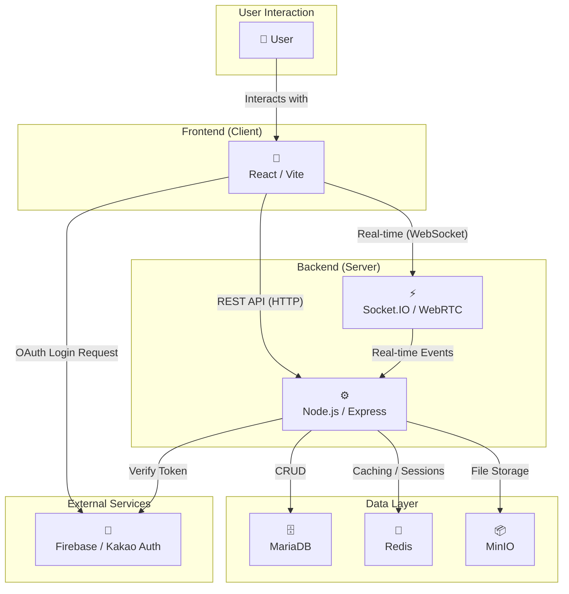

# 🚀 StudyMate - 함께 성장하는 스터디 플랫폼

**StudyMate**는 함께 배우고 성장하고 싶은 사람들을 위한 온라인 스터디 그룹 플랫폼입니다. 
 스터디를 만들고, 참여하고, 멤버들과 실시간으로 소통하며 목표를 향해 나아가세요.

 

  

 

## 👥 구성원

<table align="center">
  <tr>
    <td align="center" width="200">
      <a href="https://github.com/HaeBun">
        
         
        <b>김인태 (HaeBun)</b>
      </a>
       
      프론트엔드 (React)
    </td>
    <td align="center" width="200">
      <a href="https://github.com/jkj5747">
        
         
        <b>장경준 (jkj5747)</b>
      </a>
       
      백엔드 (Node.js)
    </td>
  </tr>
</table>

 

## 📚 프로젝트 문서

각 파트별 상세 문서는 아래 링크를 통해 확인하실 수 있습니다.

  
  &nbsp;
  
  &nbsp;
  
  &nbsp;
  

 

## 🏛️ 아키텍처

---

## ✨ 주요 기능

- **스터디 그룹**: 누구나 쉽게 스터디를 만들고 참여자를 모집할 수 있습니다.
- **실시간 채팅**: 스터디 멤버들과 아이디어를 공유하고 파일을 주고받으세요.
- **화상 스터디**: WebRTC 기반의 화상 통화로 원격 스터디를 진행할 수 있습니다.
- **일정 관리**: 스터디별 캘린더로 중요한 일정을 놓치지 마세요.
- **프로필**: 나를 표현하고 다른 스터디 멤버들을 확인하세요.

## 🛠️ 기술 스택

- **Frontend**: React, Vite
- **Backend**: Node.js, Express, Socket.IO, WebRTC
- **Database**: MariaDB
- **Authentication**: JWT, Firebase, Kakao OAuth
- **Deployment**: Docker, Nginx
